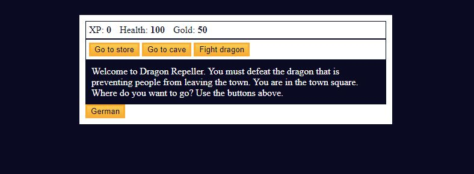

# Dragon Repeller

## Table of contents

- [Overview](#overview)
  - [The challenge](#the-challenge)
  - [Screenshot](#screenshot)
  - [Links](#links)
- [My process](#my-process)
  - [Built with](#built-with)
  - [What I learned](#what-i-learned)
  - [Continued development](#continued-development)
- [Author](#author)

## Overview

### The challenge

Users should be able to:

- View the optimal layout for the app depending on their device's screen size
- Press buttons based on decision
- Experience a dungeon simulator

### Screenshot

### Links

- Live Site URL: [View](https://camkol.github.io/DragonRepeller/)

## My process

- Player stats such as experience points (xp), health, gold, current weapon, and inventory are initialized. HTML elements and buttons are linked to JavaScript variables for interaction.
- The game defines various locations, monsters, weapons, and actions using arrays and objects. Buttons are assigned onclick functions corresponding to different in-game actions, such as going to locations, buying/selling items, and fighting monsters.
- Combat involves attacking, dodging, and calculating damage based on the player's weapon and the monster's level. Outcomes are processed, including gaining or losing gold and xp, defeating monsters, and determining victory or defeat.
- The game includes special events like an easter egg with a number-picking game. Restart and replay options are available upon winning or losing the game.
- The game features localization to create a German version for your son. Text elements, button labels, and in-game messages are translated to German, allowing your son to enjoy the game in his native language.

### Built with

- Semantic HTML5 markup
- CSS custom properties
- Flexbox
- CSS Grid
- Mobile-first workflow
- Mobile-Responsive Design
- JavaScript - Scripting language

### What I learned

This helped me with my perspective of function creation. I really gained the outlook of an engineer. We make tools(functions) to use.

### Continued development

I want to later to include images and animation.

## Author

- Website - [Cameron Howze](https://camkol.github.io/)
- Frontend Mentor - [@camkol](https://www.frontendmentor.io/profile/camkol)
- GitHub- [@camkol](https://github.com/camkol)
- LinkedIn - [@cameron-howze](https://www.linkedin.com/in/cameron-howze-28a646109/)
- E-Mail - [cameronhowze4@outlook.com](mailto:cameronhowze4@outlook.com)
